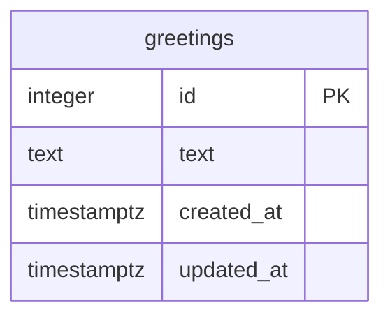

# ERD — hello-word-6

## Entities

## Tables

### `greetings`

Single-row table that stores visible home-page greeting.

| Column | Type | Constraints | Purpose |
|---|---|---|---|
| `id` | `integer` | Primary key, `CHECK (id = 1)` | Enforces one canonical greeting row. |
| `text` | `text` | `NOT NULL`, `CHECK (length(text) > 0)` | Exact text rendered by frontend. |
| `created_at` | `timestamptz` | `NOT NULL DEFAULT now()` | Row creation time. |
| `updated_at` | `timestamptz` | `NOT NULL DEFAULT now()` | Last update time. |

## Seed data

Migration inserts one row:

| `id` | `text` |
|---:|---|
| `1` | `Hello Word` |

## Relationships

None. Project has one table only.

## Notes

- Backend reads `greetings.id = 1`.
- Missing row is an error, not fallback text.
- Empty text is blocked by database constraint and also treated as API error if encountered.
